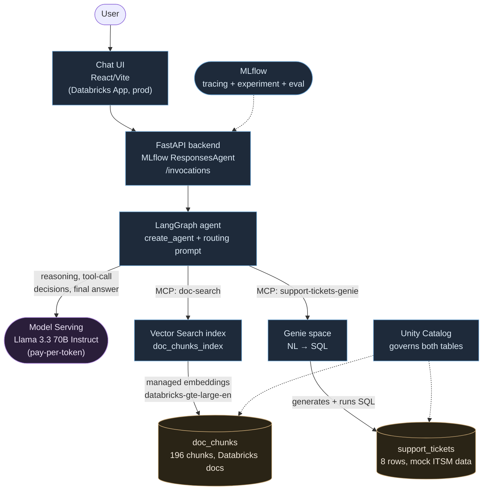

<div align="center">

# databricks-twin

<h3><em>A functional exploration of Databricks' agentic AI stack, built to prove I understand the platform — not just describe it</em></h3>

</div>

---

*Elevator pitch, written to be said out loud: [`communication/pitch.md`](communication/pitch.md).*

## Why this exists

I'm preparing for a **Databricks-related interview**. Rather than just reading the docs, I built a
real agent on the real platform: a Databricks workspace (Free Edition — no card, $0 cost), Unity
Catalog, Vector Search, Genie, Model Serving, MLflow, and Databricks Apps, all actually used, not
described secondhand.

This is a companion project to [`openrag-twin`](https://github.com/valentinleconte/openrag-twin), a
same-spirit replica of IBM's OpenRAG built for a different interview. That one showed depth on one
stack; this one is about **breadth without losing rigor** — I wanted to show I'm not locked into one
vendor's tools, and that switching stacks doesn't mean switching standards.

One structural thing worth saying upfront, because it's easy to gloss over: **Databricks is a SaaS
platform, not something you `docker compose up`.** OpenRAG was a self-hostable, Apache-2.0 product I
could literally clone and run in containers with no account. There's no equivalent here — this repo
is built *on* a real Databricks workspace, using Databricks' own resources (Unity Catalog tables, a
Vector Search index, a Genie space), not a sandboxed copy of anything. The honest framing is "I built
on the real platform with their real tools," not "I forked their product."

The base is [`databricks/app-templates/agent-langgraph`](https://github.com/databricks/app-templates/tree/main/agent-langgraph)
— an official, actively-maintained starter kit (LangGraph agent + MLflow `ResponsesAgent` + FastAPI +
React chat UI), not a from-scratch build. `LICENSE` and `NOTICE` are Databricks' own, carried over
unchanged — see [License](#license) below for what that license actually says, since it isn't
Apache 2.0.

## What I'm demonstrating

Two things, deliberately layered:

**1. The same routing-agent pattern, on a second vendor's real primitives.** OpenRAG's agent had to
decide between a document search and an unrelated support-ticket lookup, on every question, based on
what was actually being asked — not keyword matching. This agent makes the identical kind of
decision. Proving that pattern survives a full stack swap is the point: it shows the understanding
transfers, not that I got lucky once with one vendor's tools.

**2. A genuinely Databricks-native reimplementation of the second tool**, instead of a ported mock.
OpenRAG's ticket lookup was a hand-written Python component with an in-memory dictionary. Here, the
equivalent tool is a **Genie space** — Databricks' natural-language-to-SQL agent — pointed at a real
Unity Catalog table. The agent doesn't write SQL itself; it asks Genie a question in English, and
Genie (a Databricks-hosted service, not code I wrote) generates and runs the SQL against a governed
table. Same *shape* of tool (structured data vs. documents), completely different, more
platform-idiomatic mechanism.

| Question type | Example | What the agent must do |
|---|---|---|
| Knowledge question | *"How does Vector Search keep an index in sync with its source table?"* | Search the indexed docs, answer **only** from retrieved chunks, cite the source URL |
| Support request | *"What's the status of ticket 104, and who's it assigned to?"* | Skip the docs, ask the Genie space, return real ticket data |

## Architecture



Both tools are Databricks-hosted MCP servers (`DatabricksMCPServer` / `DatabricksMultiServerMCPClient`)
wired into the LangGraph agent — Databricks runs the retrieval/query execution server-side; the agent
code just declares the two MCP endpoints and a routing prompt. `agent_server/agent.py` is the whole
thing, well under 100 lines.

### On the model choice

No Claude is available in this workspace's pay-per-token Foundation Model roster (verified via
`databricks serving-endpoints list` — the options are Llama 3.x/4, GPT-OSS, Qwen3, Gemma 3). The
template's own default, `databricks-gpt-5-2`, doesn't exist here either — a version-skew bug in its
own right, same family as three others documented below. I picked **Llama 3.3 70B Instruct**: among
what was actually `READY`, a well-established, capable choice for agentic tool-calling.

Picking it wasn't the end of the story — I re-verified it the same way I re-verified the Opus→Sonnet
swap on openrag-twin: ran the golden set, for real, multiple times. It surfaced a genuine reliability
limitation (see [Measured, not just claimed](#measured-not-just-claimed)): on roughly 10-20% of
individual tool calls, this model emits its function-call syntax as literal text instead of a
structured call, and that turn's tool never actually executes. I chose to document and measure that
limitation rather than swap models without understanding *why* — the same principle as the Sonnet
decision on the other project: a model choice that isn't re-verified is an unverified claim.

## Measured, not just claimed

A 15-case [golden set](eval/golden_set.yaml) — 8 knowledge questions, 3 known tickets, 1 unknown
ticket, 1 mixed (both tools), 1 off-topic, 1 out-of-corpus — checks the agent against ground truth
hand-verified against the real ingested corpus and the real `support_tickets` table.

```bash
uv run --with pyyaml python3 eval/run_eval.py --runs 3 --allow-flaky
```

One pass is a sample, not a property — the agent is stochastic, and this project's own findings are
a good demonstration of why. **Latest 3-run result: 13/15, 11/15, 13/15 (mean 82%), 10/15 cases
stable across all three runs** ([`eval/last_results.json`](eval/last_results.json)). That's reported
as the honest number, not smoothed into a single lucky run.

A **lightweight MLflow-native evaluation** ([`agent_server/evaluate_agent.py`](agent_server/evaluate_agent.py))
runs the same golden set through `mlflow.genai.evaluate()` with two scorers, `RelevanceToQuery` and
`ToolCallCorrectness` — deliberately *not* the template's full 9-scorer + persona
`ConversationSimulator` setup (its placeholder test cases — Vietnamese cuisine, Fibonacci numbers —
had nothing to do with this project, and it defaulted to a Claude model this workspace doesn't have).
Result: `relevance_to_query` 0.70, `tool_call_correctness` 0.27 on the rows that scored successfully.
That gap against the golden set's 82% is real and noted as an open question rather than
reconciled — two different measurement methodologies (an LLM judge vs. deterministic content
scoring) aren't expected to agree exactly, but a gap that size is worth flagging, not averaging away.

### Bugs found & fixed

Four, kept because each one is a real, diagnosed limitation — not because the numbers above needed
padding.

> **Tool-calling reliability of Llama 3.3 70B Instruct.** On ~10-20% of individual tool calls, the
> model emits its function-call syntax as literal text —
> `<function=workspace__databricks_twin__doc_chunks_index>{"query": "..."}` — instead of a properly
> parsed structured call, and that tool never runs. Reproduced directly against the deployed
> `/invocations` endpoint (not a test-harness artifact): the same question, asked three times in a
> row, failed once and succeeded twice. The mixed-tool case — which needs two tool calls in one
> turn — hit this on **5 out of 5** attempts across every run performed, consistent with the
> hypothesis that the more tool calls a turn needs, the higher the chance at least one misfires.
> Documented and measured rather than papered over with a model swap that wouldn't have been
> re-verified.

> **Occasional hallucination on out-of-corpus questions.** Asked something real but genuinely absent
> from the 11-page corpus (cluster autoscaling configuration), the agent honestly admitted the gap
> in 4 of 6 observed runs — and in the other 2, fabricated a plausible step-by-step answer from its
> own pretrained knowledge instead of the retrieved (empty) context. A real grounding failure the
> golden set's out-of-corpus case exists specifically to catch.

> **`CAN_RUN` on a Genie space is not enough — production-only bug.** Passed locally, where I was
> testing under my own already-privileged account. Failed in production with a UC permission error:
> `CAN_RUN` on the `genie_space` bundle resource grants the app's service principal permission to
> *ask* the space, but Genie then executes its generated SQL under the *caller's own* Unity Catalog
> rights on the underlying table — a separate grant chain, invisible until deployed. Fixed with
> explicit `USE CATALOG` / `USE SCHEMA` / `SELECT` grants to the service principal; the table-level
> grant is now declared in `databricks.yml` so it survives a redeploy — the catalog/schema grants
> have no bundle-resource equivalent (`bundle validate` rejects `CATALOG`/`SCHEMA` as a
> `uc_securable` type) and stay a one-time SQL step.

> **Local CLI OAuth token cache chokes under concurrent load.** Running the MLflow-native evaluation
> locally fired ~15 concurrent scorer calls, each instantiating its own SDK client against the CLI's
> keychain-backed token cache — under that load, a large fraction failed with
> `cannot get access token: forced token refresh: cache update: exit status 45`. A fresh
> `databricks auth token` before the run cut the failure rate roughly in half but didn't eliminate
> it. Almost certainly a local-dev-only artifact: a deployed app authenticates via its service
> principal, not the CLI's keychain flow, so this shouldn't recur there.

Full write-ups, evidence, and the exact fixes are in `NOTES.md` (my own working notes, kept in
French across sessions — not required reading, linked for transparency).

## Reproducing this

There's no single "run this and it comes up" command the way `make twin-up` was for OpenRAG — this
runs on real Databricks resources, not local containers. What reproducing it actually looks like:

1. A Databricks workspace (Free Edition works — no card, no cloud account, $0 cost; confirmed it
   has everything this needs: Unity Catalog, Vector Search, Model Serving).
2. `databricks auth login --profile <name>`, then `uv run quickstart --profile <name>`.
3. `uv run --with beautifulsoup4 --with httpx --with markitdown python3 scripts/twin/setup_resources.py`
   — creates the schema, chunks and loads the doc corpus, loads the mock ticket data, creates the
   Vector Search endpoint and index. Idempotent where the Databricks APIs allow it.
4. Create the Genie space by hand in the workspace UI (there's no CLI command for this — confirmed).
   The script prints exact instructions, including the post-deploy permission grant from the bug
   above.
5. `uv run start-app` to run locally, or `databricks bundle deploy && databricks bundle run agent_langgraph`
   to actually deploy it as a Databricks App — this project has been run both ways, not just locally.

## What's mine vs. upstream

| Path | What it is |
|---|---|
| [`databricks-docs-md/`](databricks-docs-md/) | The ingested corpus — 11 pages of real Databricks docs, fetched and converted to Markdown |
| [`scripts/twin/fetch_databricks_docs.py`](scripts/twin/fetch_databricks_docs.py) | Regenerates the corpus above |
| [`scripts/twin/setup_resources.py`](scripts/twin/setup_resources.py), [`dbsql.py`](scripts/twin/dbsql.py), [`create_tickets.sql`](scripts/twin/create_tickets.sql) | One-shot, idempotent setup of every UC/Vector Search resource the agent depends on |
| [`agent_server/agent.py`](agent_server/agent.py) | Rewritten: the template's sample tool replaced with the two real MCP tools + routing prompt |
| [`agent_server/evaluate_agent.py`](agent_server/evaluate_agent.py) | Rewritten: golden set as data, 2 targeted scorers instead of the template's 9-scorer placeholder setup |
| [`eval/`](eval/) | 15-case golden set + scoring harness with multi-run stability reporting — see [`eval/README.md`](eval/README.md) for the full methodology and latest numbers |
| [`databricks.yml`](databricks.yml) | Resource grants for the Vector Search index, the Genie space, and the ticket table |
| [`.github/workflows/twin-checks.yml`](.github/workflows/twin-checks.yml) | CI on the code above (lint + syntax + golden-set schema) — zero secrets, zero live workspace needed |
| [`docs/AGENT_TEMPLATE_README.md`](docs/AGENT_TEMPLATE_README.md) | The template's original README, recovered after I nearly overwrote it (see `NOTES.md`) — kept for reference/comparison, not a fork of it |
| [`NOTES.md`](NOTES.md) | My own working notes across sessions (French) — full bug write-ups live here |
| everything else | Upstream [`databricks/app-templates/agent-langgraph`](https://github.com/databricks/app-templates/tree/main/agent-langgraph) |

## License

**Not Apache 2.0** — this is different from openrag-twin, and worth stating plainly rather than
reusing that framing. `agent-langgraph` ships under a Databricks-specific license (see
[`LICENSE`](LICENSE), carried over unchanged): use is permitted only in connection with the
Databricks Services, redistribution is allowed provided the license and `NOTICE` file are retained,
modified files are marked as such, and attribution notices are preserved — and the license
terminates if the underlying Databricks Agreement ends, unlike Apache 2.0, which has no such
dependency on an active account. `NOTICE` is included in full, unmodified.
